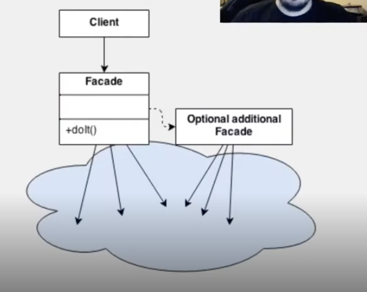

# Facade

Interface que reduz a complexidade nas integrações com subsistemas



## 📌 O que é o padrão Facade?

O padrão **Facade** (Fachada) é um padrão estrutural que fornece uma **interface simplificada** para um **conjunto complexo de classes, bibliotecas ou subsistemas**.

Ele atua como uma “fachada” que esconde os detalhes internos e expõe apenas **métodos de alto nível**, facilitando o uso e reduzindo o acoplamento.

---

## ✅ Vantagens

- **Simplifica o uso** de sistemas complexos.
- **Reduz o acoplamento** entre cliente e subsistemas internos.
- Facilita a **manutenção e evolução** do código.
- Cria uma **única entrada de acesso** a funcionalidades relacionadas.

---

## ⚠️ Quando usar?

- Quando você quer fornecer uma interface simples para um sistema complexo.
- Quando deseja dividir um sistema em camadas.
- Ao integrar sistemas legados com código novo.

---

## 🧱 Estrutura

1. **Subsistemas**: classes complexas com diversas responsabilidades.
2. **Facade**: classe que delega chamadas para os subsistemas e expõe métodos simples.
3. **Cliente**: usa apenas a fachada, sem conhecer os detalhes internos.

---

## 🧪 Exemplo prático: Sistema de pedido de compra

### 1. Subsistemas

```java
public class Estoque {
    public void atualizarEstoque() {
        System.out.println("Estoque atualizado.");
    }
}

public class Pagamento {
    public void processarPagamento() {
        System.out.println("Pagamento processado.");
    }
}

public class NotaFiscal {
    public void emitirNota() {
        System.out.println("Nota fiscal emitida.");
    }
}
```

---

### 2. Facade

```java
public class PedidoFacade {

    private Estoque estoque;
    private Pagamento pagamento;
    private NotaFiscal notaFiscal;

    public PedidoFacade() {
        this.estoque = new Estoque();
        this.pagamento = new Pagamento();
        this.notaFiscal = new NotaFiscal();
    }

    public void realizarPedido() {
        estoque.atualizarEstoque();
        pagamento.processarPagamento();
        notaFiscal.emitirNota();
        System.out.println("Pedido finalizado com sucesso!");
    }
}
```

---

### 3. Cliente

```java
public class Main {
    public static void main(String[] args) {
        PedidoFacade pedido = new PedidoFacade();
        pedido.realizarPedido();
    }
}
```

---

## 🧠 Resumo

| Elemento   | Função                                                       |
|------------|--------------------------------------------------------------|
| Facade     | Fornece uma interface simples para operações complexas       |
| Subsistema | Conjunto de classes que fazem o trabalho pesado internamente |
| Cliente    | Usa apenas a fachada, sem conhecer a complexidade interna    |

---

## 🧩 Quando **não** usar?

- Quando simplificar demais pode esconder funcionalidades importantes.
- Quando a fachada se torna muito grande e vira um "Deus" da aplicação — divida em múltiplas fachadas, se necessário.
