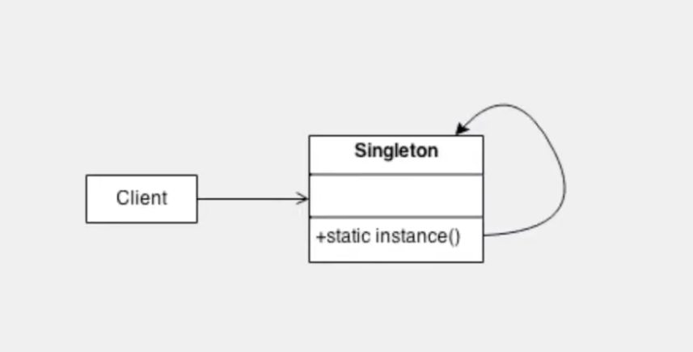

# Singleton

Permitir a criação de uma única instância de uma classe e fornecer um modo para recuperá-la.




## 📌 O que é o padrão Singleton?

O padrão **Singleton** garante que uma **classe tenha apenas uma instância** durante toda a execução do programa, e fornece um ponto global de acesso a essa instância.

---

## 🐢 O que é *Lazy Initialization*?

**Lazy Initialization** (inicialização preguiçosa) significa **adiar a criação da instância até que ela seja realmente necessária**.

Ou seja, o objeto só será criado **no primeiro momento em que for solicitado**, e não na carga inicial do programa.

---

## ✅ Por que usar isso?

- Economiza memória (só cria o objeto se for usado).
- Garante que existe apenas **uma instância da classe**.
- Útil para classes que controlam recursos, como conexões com banco de dados, arquivos, etc.

---

## 🧱 Estrutura básica do Singleton Lazy em Java

```java
public class MeuSingleton {
    // 1. A instância privada e estática começa nula
    private static MeuSingleton instancia;

    // 2. Construtor privado evita que criem objetos fora da classe
    private MeuSingleton() {
        System.out.println("Instância criada!");
    }

    // 3. Método público de acesso à instância
    public static MeuSingleton getInstancia() {
        if (instancia == null) {
            instancia = new MeuSingleton(); // cria só se ainda não foi criada
        }
        return instancia;
    }
}
```
## 🧠 Resumo

| Conceito             | Explicação                                              |
|----------------------|----------------------------------------------------------|
| Singleton            | Garante uma única instância da classe                   |
| Lazy Initialization  | A instância só é criada quando for usada                |
| Vantagem             | Economia de memória e controle de recursos              |
| Cuidados             | Precisa ser thread-safe em ambientes concorrentes       |


# Eager

## ⚡ O que é Eager Initialization?

**Eager Initialization** (inicialização ansiosa) é uma forma de implementar o padrão Singleton onde a **instância é criada no momento em que a classe é carregada pela JVM**. Isso significa que a instância será criada mesmo que nunca venha a ser usada.

---

## ✅ Vantagens

- Implementação **simples e direta**.
- **Thread-safe por natureza**, pois a JVM garante que a inicialização de classes é feita de forma segura.
- Ideal quando se tem **certeza de que a instância será usada**.

---

## ⚠️ Desvantagens

- Pode causar **uso desnecessário de memória** caso a instância nunca seja utilizada.
- Pode prejudicar o desempenho em programas com inicialização pesada ou de uso limitado da instância.

---

## 🧱 Implementação do Singleton Eager

```java
public class MeuSingleton {
    // Instância criada no carregamento da classe
    private static final MeuSingleton instancia = new MeuSingleton();

    // Construtor privado evita que outras classes criem instâncias
    private MeuSingleton() {
        System.out.println("Instância criada!");
    }

    // Método público de acesso à instância
    public static MeuSingleton getInstancia() {
        return instancia;
    }
}
```

---

## 💡 Como usar

```java
public class Main {
    public static void main(String[] args) {
        MeuSingleton s1 = MeuSingleton.getInstancia();
        MeuSingleton s2 = MeuSingleton.getInstancia();

        System.out.println(s1 == s2); // true — mesma instância
    }
}
```

---

## 🧠 Resumo

| Característica            | Singleton Eager                     |
|---------------------------|-------------------------------------|
| Criação da instância      | Na carga da classe (de forma ansiosa) |
| Thread-safe               | ✅ Sim                              |
| Complexidade              | 🔹 Baixa (fácil de implementar)     |
| Uso ideal                 | Quando a instância **sempre será usada** |
| Possível problema         | Pode instanciar algo **desnecessariamente** |


## 🐢 O que é Lazy Holder?

O **Lazy Holder** é uma forma **eficiente e thread-safe** de implementar o padrão Singleton em Java usando uma **classe interna estática**. Ele aproveita a garantia da JVM de que a classe interna só será carregada **quando for usada pela primeira vez** — ou seja, a inicialização é **lazy (preguiçosa)** e **thread-safe** **sem necessidade de sincronização manual**.

---

## ✅ Vantagens

- ✅ **Lazy Initialization** — só cria a instância quando for realmente necessária.
- ✅ **Thread-safe** — garantido pela JVM sem uso de `synchronized`.
- ✅ **Alto desempenho** — sem penalidades de sincronização.
- ✅ **Código simples e limpo**.

---

## ⚠️ Desvantagens

- ❗ Nenhuma relevante para a maioria dos casos.
- ❗ Pode ser menos compreendido por iniciantes, já que envolve classe interna estática.

---

## 🧱 Implementação com Lazy Holder

```java
public class MeuSingleton {

    // Construtor privado
    private MeuSingleton() {
        System.out.println("Instância criada!");
    }

    // Classe estática interna responsável por segurar a instância
    private static class Holder {
        private static final MeuSingleton INSTANCIA = new MeuSingleton();
    }

    // Método de acesso à instância
    public static MeuSingleton getInstancia() {
        return Holder.INSTANCIA;
    }
}
```

---

## 💡 Como usar

```java
public class Main {
    public static void main(String[] args) {
        MeuSingleton s1 = MeuSingleton.getInstancia();
        MeuSingleton s2 = MeuSingleton.getInstancia();

        System.out.println(s1 == s2); // true — mesma instância
    }
}
```

---

## 🧠 Resumo

| Conceito        | Explicação                                                        |
|-----------------|--------------------------------------------------------------------|
| Singleton       | Garante uma única instância da classe                             |
| Lazy Holder     | Usa classe interna para inicialização preguiçosa e segura         |
| Vantagem        | Combina lazy loading + segurança para multithread + performance   |
| Cuidados        | Pode ser menos intuitivo para quem não conhece classes internas   |


## 🔄 Comparação entre implementações de Singleton em Java

| Implementação     | Instanciação         | Thread-safe | Desempenho | Complexidade | Observações                          |
|------------------|-----------------------|-------------|-------------|--------------|--------------------------------------|
| Lazy             | Sob demanda (tardia)  | ❌ Não (sem sincronização) | Médio        | Baixa        | Simples, mas precisa cuidado com concorrência |
| Eager            | Ao carregar a classe  | ✅ Sim       | Alto        | Muito baixa  | Usa mais memória se nunca for usada  |
| Lazy Holder      | Sob demanda (tardia)  | ✅ Sim       | Alto        | Média        | Recomendado: lazy + seguro + rápido |


