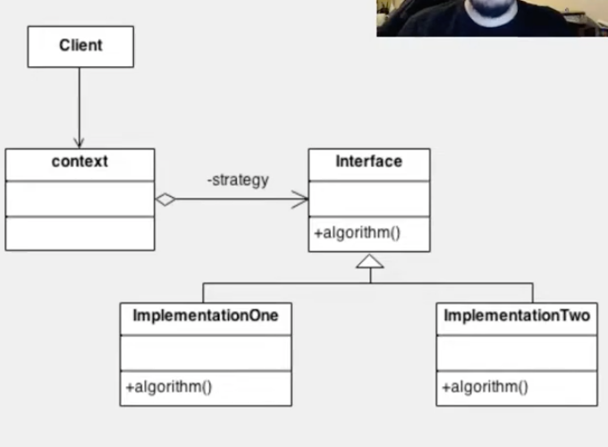

# Strategy

Tem a função de simplificar a variação de algorítimos para a resolução de um mesmo problema a partir de uma mesma interface





O padrão **Strategy** é um padrão comportamental que permite **encapsular diferentes algoritmos** (ou comportamentos) e torná-los **intercambiáveis** em tempo de execução.

Ele é usado quando você tem várias maneiras de executar uma tarefa, e quer deixar o código flexível e extensível, **sem usar condicionais (`if`/`switch`) espalhadas pelo sistema**.

---

## ✅ Vantagens

- Abre caminho para o **princípio do aberto/fechado (OCP)**: é fácil adicionar novos comportamentos sem modificar o código existente.
- **Remove lógica condicional complexa**, substituindo-a por composição de objetos.
- Torna o código mais **modular e testável**.

---

## 🧱 Estrutura

1. **Strategy (Interface)**: define o comportamento comum.
2. **Concrete Strategies (Implementações)**: implementam diferentes comportamentos.
3. **Context**: usa uma Strategy e permite trocá-la dinamicamente.

---

## 🧪 Exemplo prático: Calculadora com operações

### 1. Interface da estratégia

```java
public interface Operacao {
    int executar(int a, int b);
}
```

---

### 2. Estratégias concretas

```java
public class Soma implements Operacao {
    public int executar(int a, int b) {
        return a + b;
    }
}

public class Subtracao implements Operacao {
    public int executar(int a, int b) {
        return a - b;
    }
}

public class Multiplicacao implements Operacao {
    public int executar(int a, int b) {
        return a * b;
    }
}
```

---

### 3. Contexto que usa a Strategy

```java
public class Calculadora {
    private Operacao operacao;

    public void setOperacao(Operacao operacao) {
        this.operacao = operacao;
    }

    public int calcular(int a, int b) {
        return operacao.executar(a, b);
    }
}
```

---

### 4. Uso na prática

```java
public class Main {
    public static void main(String[] args) {
        Calculadora calc = new Calculadora();

        calc.setOperacao(new Soma());
        System.out.println("Soma: " + calc.calcular(5, 3)); // 8

        calc.setOperacao(new Subtracao());
        System.out.println("Subtração: " + calc.calcular(5, 3)); // 2

        calc.setOperacao(new Multiplicacao());
        System.out.println("Multiplicação: " + calc.calcular(5, 3)); // 15
    }
}
```

---

## 🧠 Resumo

| Elemento     | Função                                      |
|--------------|---------------------------------------------|
| Strategy     | Interface que define o contrato do algoritmo |
| Concrete     | Implementações diferentes do mesmo contrato  |
| Context      | Usa a Strategy e permite trocar dinamicamente |

---

## 🧩 Quando usar?

- Quando você tem **múltiplos algoritmos** para uma mesma tarefa.
- Quando quer evitar **múltiplos `if` ou `switch`**.
- Quando precisa de **flexibilidade para trocar comportamentos em tempo de execução**.
